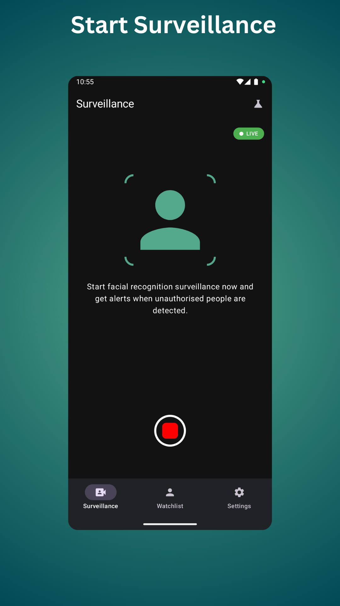
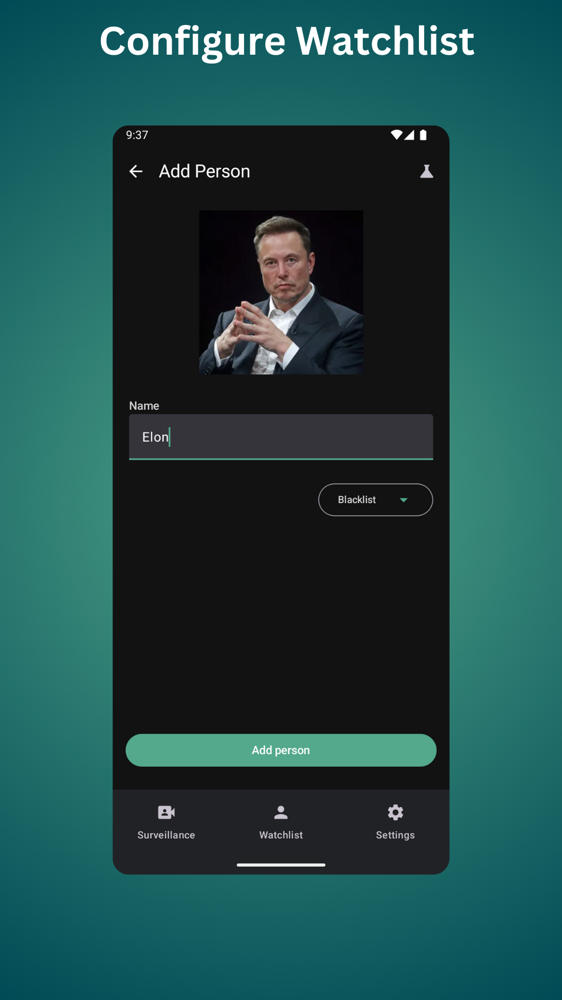
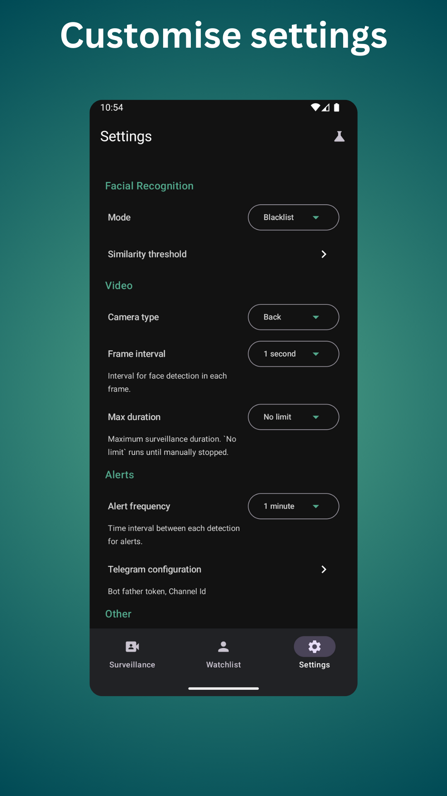

# Sentinel Lens – Facial Recognition Surveillance App

**Sentinel Lens** is a facial recognition surveillance app that sends Telegram alerts when unauthorized individuals are detected, based on a configurable blacklist and whitelist.

| |  |  |  |
| --- | --- | --- | --- |

---

## Key Features

- Background recording  
- Facial recognition surveillance  
- Telegram alert integration  
- Configurable Watchlist (blacklist and whitelist)
- Use front or back camera  
- Saved camera footage  

### Potential Future Features

- Live camera preview  
- Remote live feed viewing from another device  
- Additional alert triggers  
- Support for other alert channels (e.g., Discord)

---

## Getting Started

### 1. Configure the Blacklist or Whitelist

Navigate to the `Watchlist` screen to upload images of individuals. Assign a name and specify whether they belong on the **blacklist** or **whitelist**. 

Use the `Test` screen to verify recognition by uploading an image and checking detection accuracy against your configured list.

### 2. Set Up Telegram Alerts

In `Settings`, configure Telegram by entering your bot token (available from [@BotFather](https://t.me/botfather)).  
Specify the Telegram destination for alerts: either a public channel (e.g. `@myChannelName`) or a private chat ID (e.g. `11282822932`).  
The app functions without Telegram, but you won’t receive real-time alerts unless configured.

**Note**: Make sure your bot is in your channel otherwise alerts will not work.

### 3. Start Surveillance

Once your Watchlist and Telegram settings are configured, go to the `Surveillance` screen and press the record button to start monitoring.

---

## Download

Download the latest APK from the [Releases](https://github.com/dev-diaries41/sentinel-lens/releases/latest) page.

<!-- 

  

 -->

---

## Support the Project

Sentinel Lens is free and open source. If you find it useful and want to support ongoing development, consider donating:

| Cryptocurrency | Address |
|----------------|---------|
| **Bitcoin**    | `bc1qw46nxjp5gkh460ewamjd3jfeu0xv6ytq5et6xm` |
| **Ethereum**   | `0xa53aC18B25942C71019f85314AF67F6132E525ad` |
| **Litecoin**   | `ltc1q2hspfea9rw5j2ymvv22hx7dmckh8c99sqk7av3` |

---

## License

- This project is licensed under the **GNU General Public License v3.0**.
- See the [LICENSE](LICENSE) file for details.
